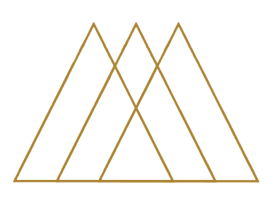

 

# Chef Prime

This website was created from an idea I had while I was a private chef in the Algarve, Portugal. Our main service was to cater for families who were going on vacation in the region and wanted a private chef service in their homes.

The website will be aimed at people interested in having a premium service, such as having their own professional chef cook for them.

[See deployed website](https://goncalves95.github.io/Algarve_Chef_Prime/)

## Table of content

- [Chef Prime](#chef-prime)
  - [Table of content](#table-of-content)
  - [Design and User Experience](#design-and-user-experience)
    - [Design](#design)
  - [Layout](#layout)
    - [Navbar and footer](#navbar-and-footer)
    - [Home Page](#home-page)
    - [Gallery Page](#gallery-page)
    - [Contact Page](#contact-page)
    - [Booked Page](#booked-page)

## Design and User Experience

### Design

The design of the website is minimalist, to allow the content to show up.

Fonts:

- Poiret one - This is the brand font, so it's used for the Logo, the Wines names and the tasting expeciences names.
- Montserrat (sans serif) - Used for the headings, the menu and the footer.
- Cormorant Garamond (serif) - As serif font is used for the smaller text (paragraphh content), it's more readable.

Colours:

- Primary color.   Secondary color.    Gold secondary color.

## Layout

There are three pages: Home page, Gallery and Contact.
In each page we have a responsive navbar on top and a footer with social media links and a coopyright section.

### Navbar and footer

Both navbar and footer change layout depending on the size of the screen.

- __Navigation bar__

  - All the navigation items are visible on larger screen (769px and up), while they are hidden in a colapsing navbar on smaller screens (768px and down).

  - The colapsing navbar has an hamburger menu icon when it's closed, and an x symbol when it's open.

- __Footer__

  - The footer contains:
    - copyrights
    - social media links

  - When clicking on the social links, this gone open in a new tab.

### Home Page

- __Hero-Image__

  - This is the landing page for our users, so it has an eye-catching hero image to grab their attention.
  - The Hero Image contains the principal message from the page. In the Home page its the message "Privet Chef's in your Home or Event"
  in the gallery page is "Privet Chef's Gallery History"
  and in the contact page "Privet Chef's Contact us!" this tops for help the user recognise where he are.

- __About__

The home page contain the information about the company. In particular it contains two distinc sections:

- The Algarve, one smal paragraph for descrive the Algarve, where is the work region of the company.

- The about, where the user can finde and read what the company do and what can expect from them.

- __Our Services__

  - In this section I have placed one cards section describing each service provided by the company.  
  - There is one section for each service.
  - It contains one image, a title and a brief description of each service.

 

### Gallery Page

- __Images__

  - On this page you will find simplified information about the services we have already provided. Some images of events and private services provided by the company.

 

### Contact Page

- This Page contains a form to contact the company and ask one quote.
- The following fiels are required: Name, Email, Service equired,  Number of people, start and end date of the event.
- There is an additional field to add other information or some doubt. not required field.
- The select element for "Number of People" allows choosing the number of people for the events and, depending on the choice, the company's decision to hire more staff depending on the number of people attending the event, thus giving the client a better price for the service.
- in this extra field exist on I icon with extra informtion for the user know what can fill up in this field.

- __Booked Page__

  - After filling out all the mandatory field, users are redirected to a new page.
  

### Booked Page

- Have the Logo company in the Header.
- Have a small video about Algarve so that users can get to know the region they're visiting better and discover more places to visit on their holidays or when they're in the Algarve.
- Thank's message for the contact.
- Company contact in case they have more questions or they need to cancel or modify the sercvie.
- In the information existe the email, here the user can click on the link and open an email page with the company email address already filled in.  
- In the contact information field there is also an address, which when selected opens the map in a new tab for directions to the location.
- A call to action to bring the user back to the homepage, with direct link, so that users are not redirected automatically. The user can clic on the message "back to Home " or in the LOGO.